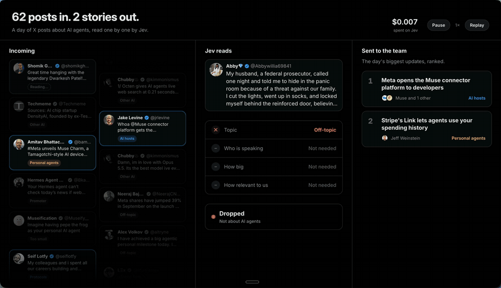

# xscout

Watches X for the updates that matter to you, has [Jev](https://docs.typesafe.ai) judge them, and tells you in Slack early enough to act on them.

You describe what you care about in one YAML profile: who you are, the topics you follow, the accounts and keywords to watch, what makes an update big or relevant for you, and what you would do with it. xscout collects matching posts, has [Jev](https://docs.typesafe.ai) judge each one against your profile, groups posts about the same update, and alerts when an update is big, trending or notable. Each alert comes with a ready-to-paste prompt to draft a post, a sales brief or whatever you do next (`pnpm scout show <id>`).



An alert in Slack looks like this (from the [`ai-apps`](profiles/ai-apps.yaml) example, which watches the AI app ecosystem):

```text
*BIG* · Protocols · #42
We're adding support for WebMCP in the ChatGPT desktop app's built-in browser and ChatGPT Sites…
@OpenAIDevs · 3 accounts · score 4.4 · 2 official · 1 news · 3 acc/6h
```

## How it works

1. **Collect.** [treg](https://treg.to) searches X for posts from your primary accounts (official sources) and amplifiers (news accounts) on every run, and for your keywords every 30 minutes.
2. **Judge.** Jev classifies each new post (topic, speaker, exclusions), then scores it: significance for your field plus relevance to you, and which of your actions apply. Related posts are grouped into events.
3. **Decide.** Deterministic rules combine the score with momentum (official sources, news coverage, bursts of accounts, engagement velocity, freshness) to raise **big**, **trending** or **notable** alerts, with a daily cap on notable ones. Scheduled runs hold alerts on weekday evenings and weekends by default. Later posts from official or news accounts on an alerted event become updates.

State lives in SQLite under `data/<profile name>/`. Alerts, with their drafting prompts, are appended to `alerts.jsonl` there and, with `notify`, posted to Slack.

## Set up

xscout works for fields that are active on X: tech, AI, developer tools, crypto, finance, media, politics. Some markets barely post there; `validate --online` tells you early when most of the accounts you care about are missing or quiet.

You need Node.js 22.13 or later, pnpm, and two API accounts:

- [TypeSafe](https://typesafe.ai) for Jev: put the key in `TYPESAFE_API_KEY`. An OpenRouter key also works with `TYPESAFE_BASE_URL=https://openrouter.ai/api`.
- [treg](https://treg.to) for X search: sign in with its CLI (`treg login`), or put an API token in `TREG_TOKEN`.

### With Claude Code

```text
/plugin marketplace add ethan-ab/xscout-jev
/plugin install xscout@xscout-jev
```

Then ask Claude to set up xscout for you. The `scout-setup` skill interviews you, researches the accounts and keywords to follow, writes and checks the profile, replays the last days with you to tune it, and schedules it. The `scout` skill helps with day-to-day use. Both skills are also available when you open a clone of this repository in Claude Code.

### By hand

```bash
git clone https://github.com/ethan-ab/xscout-jev xscout && cd xscout
pnpm install
cp .env.example .env              # add TYPESAFE_API_KEY; run `treg login` or set TREG_TOKEN
pnpm scout init                   # copies profiles/starter.yaml to scout.yaml: edit it
pnpm scout validate --online      # checks the profile, keys, every account and keyword
pnpm scout scan 24                # the alerts you would have had over the last 24 hours
```

Each scan writes to its own database and prints the command to see what was kept or dropped and why (`SCOUT_DB=<scan database> pnpm scout posts`). Tune the profile until a day of alerts looks right, then schedule `pnpm scout notify` every 10 minutes: see [docs/deploy.md](docs/deploy.md) for cron, launchd, GitHub Actions and [Hermes](https://github.com/NousResearch/hermes-agent).

Examples to start from: [`starter`](profiles/starter.yaml) (ecosystem watch, fully commented), [`competitive-intel`](profiles/competitive-intel.yaml) (competitor launches, pricing, funding and incidents) and [`ai-apps`](profiles/ai-apps.yaml) (the AI app ecosystem, the most tuned example, with a benchmark set). Every field is described in [docs/profile.md](docs/profile.md).

## Commands

```bash
pnpm scout [--profile <file>] [--json] <command>
```

| Command | What it does |
| --- | --- |
| `init [template] [--output <file>] [--force]` | Copy an example profile to `scout.yaml` (or `--output`). |
| `validate [--online]` | Check the profile, keys and keyword syntax; `--online` also checks every account and keyword on X. |
| `poll` | Run one collection and decision cycle. |
| `notify` | `poll` for schedulers: prints new alerts as a Slack message and posts it to `SLACK_WEBHOOK_URL`; prints nothing when there is nothing new. Holds alerts on weekday evenings and weekends unless `SCOUT_QUIET_HOURS=0`. |
| `watch [minutes]` | Run `poll` every N minutes (default 10). |
| `status` | Last runs, events, alerts in the last 24 hours, spend. |
| `events [status]` | List events. |
| `posts [kept\|dropped] [--limit N]` | Collected posts, newest first: the search that found each one, and whether it was kept or dropped and why. |
| `show <id>` | Show an event, its posts and its drafting prompt. |
| `feedback <id> good\|skip` | Record feedback. When more than half of at least 6 feedbacks in 7 days are `skip`, the alert threshold rises by 0.25. |
| `costs` | Daily treg and Jev spend, including scans and online checks. |
| `scan [hours]` | Collect a past window into a new database and replay it (default 168 hours). |
| `replay` | Show when each stored event would have been flagged live. |
| `backtest [labels.tsv]` | Recall and false alerts on a labelled set of posts. See [docs/benchmark.md](docs/benchmark.md). |

The profile comes from `--profile`, else `SCOUT_PROFILE`, else `scout.yaml`. `SCOUT_DB` points any command at another database, such as a scan's.

## Costs

You pay treg per X search and TypeSafe per token; xscout itself is free.

- **Searches per day** ≈ 144 × ⌈accounts / 12⌉ + 48 × keywords at the default intervals. In our runs a search cost about $0.00065.
- **Jev** is priced at $0.042 per million input tokens. Each new post takes one to three calls of about a thousand tokens.

The `ai-apps` example (43 accounts, 17 keywords) comes to roughly 1,400 searches a day, about $0.90, plus Jev. Set `budget.usd_per_day` in the profile to cap spend; `pnpm scout costs` shows the actual spend per day.

## Development

```bash
pnpm check    # typecheck, lint, tests
pnpm format   # apply formatting
```

See [AGENTS.md](AGENTS.md) for the code layout and conventions, and [CONTRIBUTING.md](CONTRIBUTING.md) to contribute.

## License

[MIT](LICENSE)
